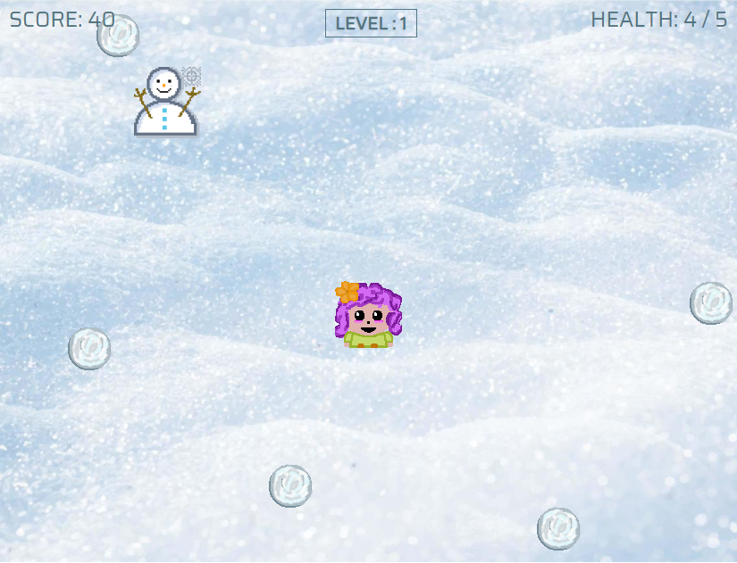

# Object Oriented Programming Game Project

Game link: https://snowfight-escape-demo.netlify.app

# Introduction

This game was created as a Javascript project for the Full-Stack Web bootcamp from Concordia University, where each student had to debug and add functionnalities to a provided 'broken' game.

# The game

The goal of **Snowfight Escape** is to dodge the enemy's snowballs and accumulate as much points as possible. 

The user uses the arrows to navigate and starts with 5 lives.

**Items** will randomly pop and either restore +1 health (hot chocolate) or grant 100 points (snowman).

## Improvements

- The player can also move up and down.
- Added a scoring system with points that increment every few seconds.
- Added lives.
- Added levels where difficulty increases with time. The number of enemies and their speed increases.
- Enemies also come from the left with horizontal pathing.
- Created 2x items that give points and restore lives.
- Added background music and sound effects when hit or when an item is found.
- Added a 'shaking' animation on the player when he is hit.
- Added a start and restart page.
- Changed height and width of game screen.
- Changed background.

## Sources and tools

- Music and sound effects: https://www.zapsplat.com/
- Webtool for creating the pixel art (player, items, snowballs): https://www.pixilart.com/
